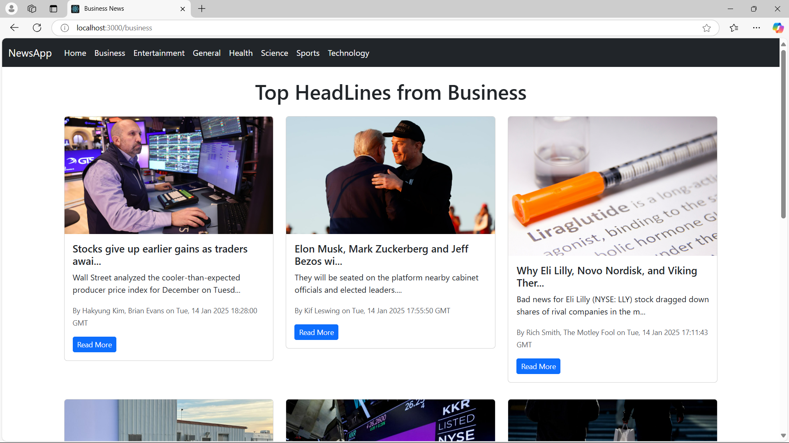

# News App 📢

A React-based web application that fetches and displays real-time news articles from various categories using the [News API](https://newsapi.org/).

## Features ✨
- Fetches real-time news articles from different categories (e.g., Technology, Sports, Business).
- Displays news headlines, descriptions, and links to full articles.
- Fully responsive design for optimal viewing on all devices.
- Smooth user interface with category navigation for easy news filtering.
- Allows users to explore trending news and stay updated.

## Prerequisites 🛠️
Before you begin, ensure you have the following:
- Node.js installed on your system.
- A valid API key from the [News API](https://newsapi.org/).

## Technologies Used 💻
Frontend: React.js, CSS, JavaScript
API: News API

## Images 📸

